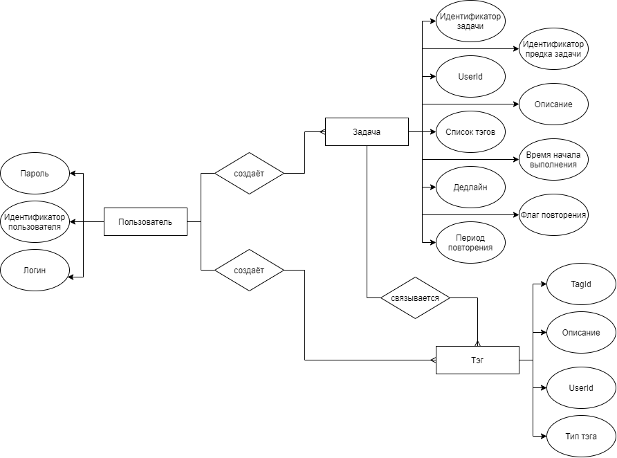
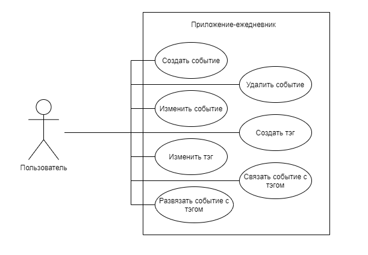

# Lab 1
## Название проекта
Planum

## Краткое описание идеи проекта
Идея проекта - создание десктоп-приложения для помощи пользователю в организации его времени. Созданное приложение позволит пользователю создавать, изменять, удалять или архивировать задачи, а также просматривать созданные задачи в различных форматах (календарь, список, карта разума).

## Описание предметной области
Данное программное обеспечение рассчитывается на людей, ищущих удобный, быстрый и безопасный способ организовать своё время. Ниже описаны сущности предметной области:

1. Задача - сущность, описывающая некоторую реальную цель или задачу. Основные параметры задачи - время начала выполнения, дедлайн, список тэгов, флаг повторения, период повторения, пользователь, которому эта задача принадлежит, уровень задачи (неделя, месяц, год), задача-родитель.
2. Тэг - сущность принадлежности, задача может быть связана с несколькими такими сущностями, и каждая такая связь обозначает принадлежность задаче определённой группе сущностей.
3. Пользователь - сущность, описывающая пользователя приложения. Основные параметры - login/password для входа, id пользователя.

## Краткий анализ аналогичных решений
|название приложения|Desktop версия|тэги|группировка по тэгам|календарь|карта разума|повторящющиеся события|уровни планирования|списки завершённых событий|
|-|-|-|-|-|-|-|-|-|
|Any.do|v|v|v|v|x|v|v|v|
|Click up|v|v|v|v|v|v|x|v|
|Trello|v|v|v|x|x|x|x|v|
|Todoist|v|v|v|v|x|v|x|v|
|Notion|v|v|v|v|x|v|v|v|
## Краткое описание целесообразности и актуальности проекта
На данный момент большая часть приложений-планировщиков рассчитана на группы людей, вследствие чего многие инструменты оказываются попросту ненужными в случае их использования одним пользователем и в итоге загромождают интерфейс и замедляют работу приложения. Также многие ежедневники являются частями экосистем которые хранят данные приложения на удалённых серверах. Это приводит к тому, что данные могут быть украдены и сервис может не работать без интернета. Ещё одним важным моментом является то, что не смотря на то, что многие приложения имеют desktop версию, она всё равно либо зависит от интернет-подключения, либо является не самым удобным переносом web-версии.
## ER-диаграмма

## Use-Case

## Архитектурные характеристики, важные для проекта
- Расширяемость
- Standalone
- Быстродействие (оптимизация на уровне архитектуры для повышения скорости работы)
- Безопасность - дополнительное внимание уделяется защите данных
- Надёжность - данные не должны быть потеряны в случае сбоя

# Lab 2

## Технологический стек
Cross-platform на Dart + Flutter.

Fixes:
Добавить viewmodel/DTO для UI
Отдельно интерфейс, отдельно реализация, репозиторий на слой БД

Разбить контроллер, merge request